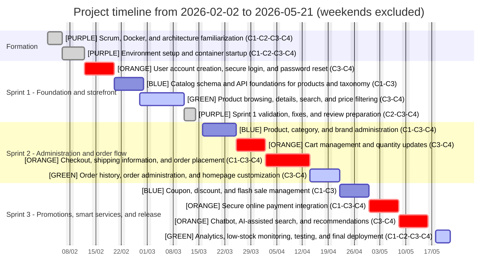

# Development Methodology and Project Planning

Replace `Member A` and `Member B` with the real names of the two team members before inserting this text into the report.

## V. Development Methodology

This project was carried out using an Agile methodology inspired by Scrum and adapted to a two-member student team working in coordination with the host company. The company encouraged an iterative and incremental way of working so that each functional block could be delivered, validated, and improved progressively instead of waiting for a single final integration phase.

This methodological choice was appropriate because the solution is based on a multi-container architecture composed of four complementary services: a PostgreSQL database container, a pgAdmin administration container, a backend API container, and a frontend web application container. In addition, the platform integrates several cross-cutting services such as authentication, email notifications, online payment, analytics, and AI assistance. For this type of project, an incremental methodology makes it easier to manage dependencies, control technical risk, and validate each module before moving to the next one.

In practice, the work was organized into three development iterations corresponding to major functional objectives. The first iteration focused on the technical foundation and the core e-commerce functions, the second iteration covered transactional and commercial features, and the third iteration concentrated on advanced services, analytics, and final stabilization. This methodology also supported continuous integration between frontend and backend tasks, regular validation of database structures, and progressive testing throughout development.

Although each team member had a lead role on some tasks, the project was developed collaboratively. Both members contributed to the backend and the frontend, while the workload was mainly distributed by feature set, technical dependency, and container responsibility. This collaborative organization improved knowledge sharing, reduced integration issues, and ensured continuity of work across the whole platform.

## Note on Scrum Terminology

According to the official Scrum Guide released in November 2020, `Sprint Planning` is an event used to determine why the Sprint is valuable, what can be done during it, and how the work will be carried out. By contrast, the ordered list of functionalities and user stories is the `Product Backlog`. For that reason, the table below is presented as a prioritized Product Backlog grouped by sprint rather than as a Sprint Planning table.

## Architecture-Based Work Distribution

| Container | Service | Role in the architecture | Main work carried out |
| --- | --- | --- | --- |
| C1 | PostgreSQL | Persistent data layer | Database creation, relational schema design, migrations, seed data, order and promotion storage, payment-related fields |
| C2 | pgAdmin | Database administration and verification | Data inspection, query validation, debugging support, database checks during integration and testing |
| C3 | Backend | Business logic and API layer | Authentication, catalog management, cart, checkout, orders, promotions, payment integration, chatbot, analytics |
| C4 | Frontend | Presentation and interaction layer | Storefront, authentication pages, product browsing, cart and checkout UI, admin dashboard, chatbot interface, analytics screens |

## I. Project Planning

The project was organized into one formation phase followed by three main sprints. The distribution below was rebalanced so that the amount of work in each sprint is more coherent with the available working days. The formation phase was reserved for onboarding, Scrum familiarization, Docker setup, and alignment on the project architecture before feature delivery started.

### Sprint Summary

| Sprint | Main objective | Duration | Dates | Main containers involved |
| --- | --- | --- | --- | --- |
| Formation | Team onboarding, Scrum familiarization, and environment setup | 8 days | 02 Feb 2026 - 11 Feb 2026 | C1, C2, C3, C4 |
| Sprint 1 | Authentication, account recovery, and the public product catalog experience | 22 days | 12 Feb 2026 - 13 Mar 2026 | C1, C2, C3, C4 |
| Sprint 2 | Catalog administration, cart, checkout, orders, and homepage management | 27 days | 16 Mar 2026 - 21 Apr 2026 | C1, C2, C3, C4 |
| Sprint 3 | Promotions, payment, AI assistance, analytics, testing, and deployment | 22 days | 22 Apr 2026 - 21 May 2026 | C1, C2, C3, C4 |

### Figure: Project Timeline by Sprint, Container, and Team Allocation

### Legend

- `BLUE` Member A lead: database and backend-oriented tasks, with active support from Member B
- `GREEN` Member B lead: interface and integration-oriented tasks, with active support from Member A
- `ORANGE` Joint work: features implemented collaboratively on both backend and frontend
- `PURPLE` Support work: training, testing, documentation, validation, and deployment
- `C1` PostgreSQL container
- `C2` pgAdmin container
- `C3` Backend API container
- `C4` Frontend web container

### Team Allocation by Container

| Container | Main technical focus | Team allocation |
| --- | --- | --- |
| C1 - PostgreSQL | Schema design, migrations, and data consistency | `BLUE` Member A lead, `ORANGE` joint validation |
| C2 - pgAdmin | Verification, inspection, and debugging support | `PURPLE` shared support task |
| C3 - Backend | REST API, business rules, integrations, and services | `ORANGE` shared development |
| C4 - Frontend | User interface, admin screens, and API integration | `ORANGE` shared development |

### Prioritized Product Backlog Grouped by Sprint

| Sprint | Product backlog item / user story | Priority | Main containers | Owner |
| --- | --- | --- | --- | --- |
| Formation | Installation and setup of the development environment | 1 | C1, C2, C3, C4 | PURPLE |
| 1 | As a user, I can create an account | 2 | C3, C4 | ORANGE |
| 1 | As a user, I can log in securely | 3 | C3, C4 | ORANGE |
| 1 | As a user, I can browse the list of products | 4 | C3, C4 | GREEN |
| 1 | As a user, I can view products by category | 5 | C1, C3, C4 | GREEN |
| 1 | As a user, I can view products by brand | 6 | C1, C3, C4 | GREEN |
| 1 | As a user, I can search for products using keywords | 7 | C3, C4 | ORANGE |
| 1 | As a user, I can filter products by price | 8 | C3, C4 | GREEN |
| 1 | As a user, I can view product details | 9 | C3, C4 | GREEN |
| 1 | As a user, I can reset my password if I forget it | 10 | C3, C4 | ORANGE |
| 2 | As an administrator, I can add products | 11 | C1, C3, C4 | BLUE |
| 2 | As an administrator, I can update products | 12 | C1, C3, C4 | BLUE |
| 2 | As an administrator, I can delete products | 13 | C1, C3, C4 | BLUE |
| 2 | As an administrator, I can manage categories | 14 | C1, C3, C4 | BLUE |
| 2 | As an administrator, I can manage brands | 15 | C1, C3, C4 | BLUE |
| 2 | As a user, I can add products to the cart | 16 | C3, C4 | ORANGE |
| 2 | As a user, I can remove products from the cart | 17 | C3, C4 | ORANGE |
| 2 | As a user, I can update product quantities in the cart | 18 | C3, C4 | ORANGE |
| 2 | As a user, I can place an order | 19 | C1, C3, C4 | ORANGE |
| 2 | As a user, I can enter shipping information during checkout | 20 | C1, C3, C4 | GREEN |
| 2 | As a user, I can view my order history | 21 | C3, C4 | GREEN |
| 2 | As an administrator, I can view all orders | 22 | C1, C3, C4 | GREEN |
| 2 | As an administrator, I can update the status of an order | 23 | C1, C3, C4 | BLUE |
| 2 | As an administrator, I can customize the homepage content | 24 | C3, C4 | GREEN |
| 3 | As a user, I can apply a coupon code during checkout | 25 | C1, C3, C4 | BLUE |
| 3 | As an administrator, I can manage product discounts | 26 | C1, C3 | BLUE |
| 3 | As an administrator, I can manage category discounts | 27 | C1, C3 | BLUE |
| 3 | As an administrator, I can manage flash sales | 28 | C1, C3 | BLUE |
| 3 | As an administrator, I can manage coupons | 29 | C1, C3 | BLUE |
| 3 | As a user, I can pay for my purchases securely online | 30 | C1, C3, C4 | BLUE |
| 3 | As a user, I can interact with an intelligent chatbot during navigation | 31 | C3, C4 | ORANGE |
| 3 | As a user, I can receive product recommendations according to my needs and budget | 32 | C1, C3, C4 | ORANGE |
| 3 | As a user, I can refine my search through the AI assistant | 33 | C3, C4 | BLUE |
| 3 | As an administrator, I can view analytics and performance indicators | 34 | C1, C3, C4 | GREEN |
| 3 | As an administrator, I can monitor sales and top-performing products | 35 | C1, C3, C4 | GREEN |
| 3 | As an administrator, I can detect low-stock products | 36 | C1, C3 | BLUE |
| 3 | Testing, validation, and bug fixing | 37 | C1, C2, C3, C4 | PURPLE |
| 3 | Final deployment of the application | 38 | C1, C2, C3, C4 | PURPLE |

## Conclusion

This methodology provided a structured yet flexible framework for developing the platform. By combining a Scrum-inspired Agile approach with a clear technical distribution across the four containers, the team was able to progress incrementally from the core platform to advanced services such as payment, AI assistance, and analytics. The use of a prioritized Product Backlog, collaborative work on both frontend and backend, and continuous validation helped ensure coherence between the functional objectives and the final implementation of the system.
