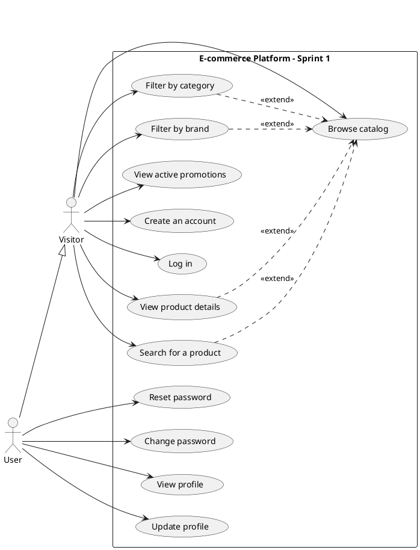
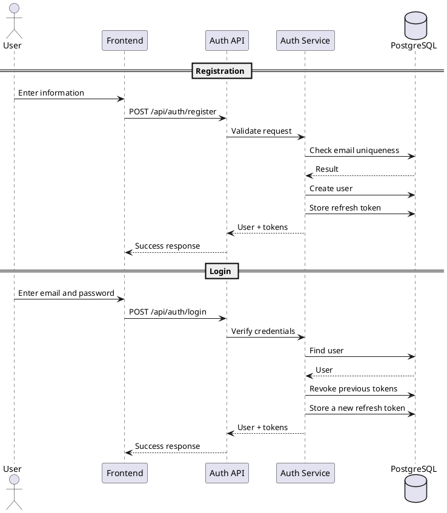
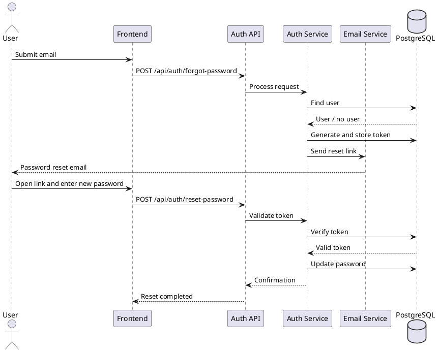
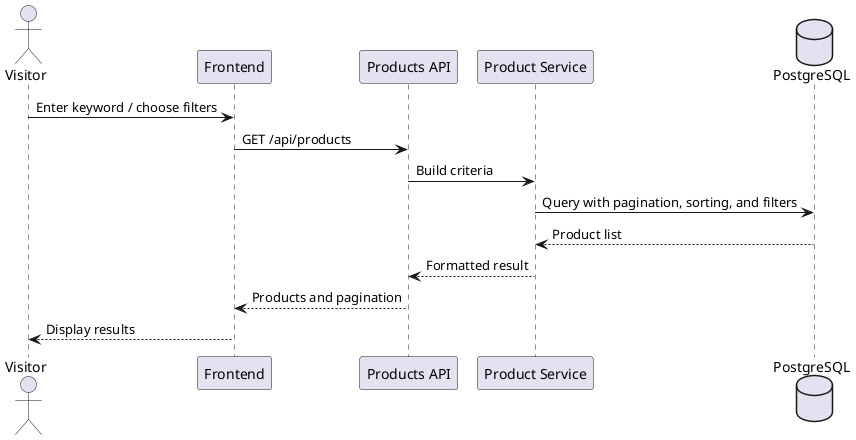
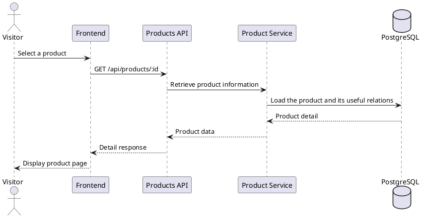

# Sprint 1 Report

## Introduction

During this first sprint, we started the core functionalities of the e-commerce platform by first setting up the working environment and the initial structure of the application. The main objective was to establish a stable technical foundation and then implement the first essential user journeys related to account management and catalog browsing.

This sprint therefore focused on starting the environment through Docker Compose, defining the database schema with Prisma, implementing authentication, managing the user profile, and delivering the first public catalog features: product listing, product detail page, search, category and brand filters, and active promotions display. These elements form the functional base of the project before the introduction of more advanced transactional features.

## I. Sprint Backlog

The following table presents the main user stories selected for Sprint 1, together with the general tasks associated with them.

| User Story | Tasks | Estimate |
| --- | --- | --- |
| Development environment setup with Docker Compose | Container configuration, service startup verification, database preparation | 3d |
| Prisma schema definition and initial migrations | Main entity modeling, relationship setup, migration generation | 2d |
| As a user, I can create an account and log in | Backend: registration, login, access and refresh tokens. Frontend: registration and login screens, form integration | 4d |
| As a user, I can reset and change my password | Backend: reset link generation, token validation, password update. Frontend: related forms | 3d |
| As a user, I can view and update my profile | Profile retrieval and update API, user screen integration | 2d |
| As a user, I can browse the product catalog | Product listing, pagination, sorting, catalog page integration and product detail page | 4d |
| As a user, I can search and filter products | Keyword search, hierarchical category filters, brand filters | 3d |
| As a user, I can view active promotions and flash sales | Active promotion retrieval and integration into the public interface | 2d |
| Sprint 1 validation and integration | API tests, main flow verification, integration fixes | 2d |

**Table 1: Sprint 1 Backlog**

**Figure 1: Detailed Sprint 1 backlog**  

## II. Environment & Development Tools

### II.1. Working Environment

- **Docker Desktop:** used during the sprint to run the local containerized workspace and validate the startup of the project services.
- **Docker Compose:** used to orchestrate the frontend, backend, database, and administration services in a single development environment.
- **PostgreSQL:** used as the main database for the project data handled in Sprint 1.
- **Prisma ORM:** used to define the initial data schema and manage the first database migrations.
- **Node.js:** used to run the backend and frontend services throughout development and integration tasks.

### II.2. Development Tools

- **Visual Studio Code:** used as the main development environment for editing, integration, and project configuration tasks.
- **GitHub:** used to host the source code and synchronize the work completed during the sprint.
- **GitHub Desktop:** used to manage commits and repository synchronization during day-to-day development.
- **Next.js:** used to implement the public storefront pages and the account-related interfaces delivered in this sprint.
- **Express:** used to organize the API routes related to authentication, profile management, products, and promotions.
- **TypeScript:** used across the application codebase to keep the service and interface layers consistent during implementation.

### II.3. Testing Tools

- **Postman:** used to validate the main API endpoints developed during Sprint 1, especially those related to authentication, profile management, and catalog access.
- **pgAdmin:** used to inspect the database state after migrations and during backend verification phases.

### II.4. Design and Modeling Tools

- **PlantUML:** used to prepare the use case and sequence diagrams associated with the Sprint 1 report.
- **Figma:** used as a reference support for interface alignment and screen organization during the frontend work.

### II.5. Project Management Tools

- **GitHub:** used as the shared repository for version control and collaborative follow-up of the implemented work.
- **Sprint user story and priority tracking board:** used to organize the sprint scope, monitor priorities, and follow the progress of planned items.

## III. Sprint Activities

### III.1. Analysis and Design Activities

The first phase of the sprint focused on defining the priority use cases of the project. For this first increment, the analysis concentrated on two main areas: user account management and the public catalog browsing experience. The design work helped structure the interactions between actors, screens, and application services, while also defining the first data flows between the frontend, backend, and database.

The following figure presents the global use case diagram of Sprint 1.

### Figure 2: Global Sprint 1 use case diagram

#### III.1.A. Account creation and authentication

- **Main actor:** Visitor
- **Description:** The visitor can create an account and then log in to the platform using their credentials. Authentication provides access to personal information and restricted features.
- **Scenario:**
  1. The visitor opens the registration page.
  2. They enter the required information.
  3. The system validates the submitted data.
  4. The account is created.
  5. The visitor can then log in.
  6. The system generates the tokens required for the session.

#### III.1.B. Password reset and password change

- **Main actor:** User
- **Description:** The user can request a password reset by email, then define a new password using a secure link. The user can also change their password from their personal area.
- **Scenario:**
  1. The user submits a password reset request.
  2. The system generates a secure link and sends it by email.
  3. The user opens the reset page.
  4. They enter a new password.
  5. The system validates the token and saves the update.

#### III.1.C. Profile viewing and update

- **Main actor:** User
- **Description:** Once authenticated, the user can view their personal information and update the editable profile data.
- **Scenario:**
  1. The user logs in.
  2. They access their personal area.
  3. The system displays the profile information.
  4. The user updates the allowed fields.
  5. The system saves the changes.

#### III.1.D. Catalog browsing and product detail

- **Main actor:** Visitor
- **Description:** The visitor can browse the product list, navigate through result pages, and open the detail page of a selected product.
- **Scenario:**
  1. The visitor opens the catalog.
  2. The system displays the paginated product list.
  3. The visitor can sort the results.
  4. They select a product.
  5. The system displays the corresponding product detail page.

#### III.1.E. Product search and filtering

- **Main actor:** Visitor
- **Description:** The visitor can search for a product using a keyword and refine the displayed results using hierarchical category and brand filters.
- **Scenario:**
  1. The visitor enters a keyword or selects a filter.
  2. The system queries the catalog according to the selected criteria.
  3. Matching results are displayed.
  4. The visitor can combine several criteria to refine the list.

#### III.1.F. Active promotions and flash sales viewing

- **Main actor:** Visitor
- **Description:** The visitor can view active promotions and temporary offers available on the platform.
- **Scenario:**
  1. The visitor opens the homepage or the promotional section.
  2. The system retrieves the active promotions.
  3. The offers are displayed with their related products.

### III.2. Backend

#### III.2.A. Specifications

The following table presents a set of the main APIs used during Sprint 1.

| URI | Method | Parameters | Description |
| --- | --- | --- | --- |
| `/api/auth/register` | POST | `name`, `email`, `password` | User account creation |
| `/api/auth/login` | POST | `email`, `password` | User authentication |
| `/api/auth/refresh` | POST | `refreshToken` | Session renewal |
| `/api/auth/forgot-password` | POST | `email` | Password reset request |
| `/api/auth/reset-password` | POST | `token`, `password` | New password validation |
| `/api/auth/change-password` | POST | `currentPassword`, `newPassword` | Password update |
| `/api/user/me` | GET / PATCH | Profile data | Profile viewing and update |
| `/api/products` | GET | `page`, `limit`, `sort`, `search`, `category`, `brand` | Catalog retrieval with pagination, sorting, and filters |
| `/api/products/:id` | GET | `id` | Product detail retrieval |
| `/api/category/tree` | GET | - | Category tree retrieval |
| `/api/brand` | GET | - | Brand list retrieval |
| `/api/promotions/active` | GET | - | Active promotions and flash sales retrieval |

**Table 2: Main Sprint 1 APIs**

#### III.2.B. Sequence diagrams

The following figure presents the registration and login scenario.

### Figure 3: Registration and login sequence diagram

The following figure illustrates the password reset scenario.

### Figure 4: Password reset sequence diagram

The following figure illustrates the product search and filtering scenario.

### Figure 5: Product search sequence diagram

The following figure presents the product detail viewing scenario.

### Figure 6: Product detail sequence diagram

### III.3. Frontend

#### III.3.A. UI screens related to the "Authenticate" use case

The following figures present the screens related to registration, login, and password reset flows.

**Figure 7: Login screen**  

**Figure 8: Registration screen**  

**Figure 9: "Forgot password" screen**  

**Figure 10: Reset password screen**  

#### III.3.B. UI screens related to the "Browse catalog" use case

The following figures present the catalog browsing and product detail screens.

**Figure 11: Homepage / catalog entry point**  

**Figure 12: Product listing**  

**Figure 13: Product detail**  

#### III.3.C. UI screens related to the "Search and filter products" use case

The following figures present the keyword search and filtering screens by category and brand.

**Figure 14: Product search screen**  

**Figure 15: Search result with filters**  

**Figure 16: Category and brand navigation**  

#### III.3.D. UI screens related to the "View promotions" use case

The following figure presents the display of active promotions and flash sales in the public interface.

**Figure 17: Promotions / flash sales block**  

### III.4. Testing Activities

#### III.4.A. Backend

Sprint 1 testing mainly focused on validating the authentication routes, profile access, catalog retrieval, search, filters, and active promotions retrieval. These checks were carried out at the API level in order to confirm data validity and the consistency of the expected responses.

**Figure 18: Postman test for the registration API**  

**Figure 19: Postman test for the login API**  

**Figure 20: Postman test for the product search API**  

**Figure 21: Postman test for the active promotions API**  

#### III.4.B. Frontend

Frontend validation focused on the correct display of authentication pages, product listing pages, product detail pages, navigation filters, and form feedback. An integration check was also carried out to confirm the correct communication between the interface and backend services.

**Figure 22: Validation of Sprint 1 frontend flows**  

### III.5. Implementation Activities

#### III.5.A. Frontend

At the end of this sprint, the frontend already provides access to the main screens related to authentication and catalog browsing. The user can log in, view the product list, open the product detail page, use search, and navigate through categories, brands, and active promotions.

**Figure 23: Catalog page result**  

**Figure 24: Product detail page result**  

#### III.5.B. Backend

The Sprint 1 backend work made it possible to stabilize the project foundation around an initial data structure, a secure authentication module, a user module for profile management, and the first catalog services. Public consultation routes and the processing related to filters and promotions were also integrated.

**Figure 25: Validation of Sprint 1 backend modules**  

## Conclusion

This first sprint made it possible to establish a usable technical base and deliver the first essential functionalities of the project. The account management and catalog browsing flows are now in place, with an initial integration between the database, backend services, and user interface. This result provides a coherent foundation for the continuation of the project and for the introduction of transactional features in the following sprints.
